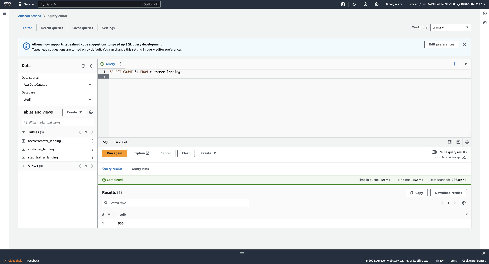
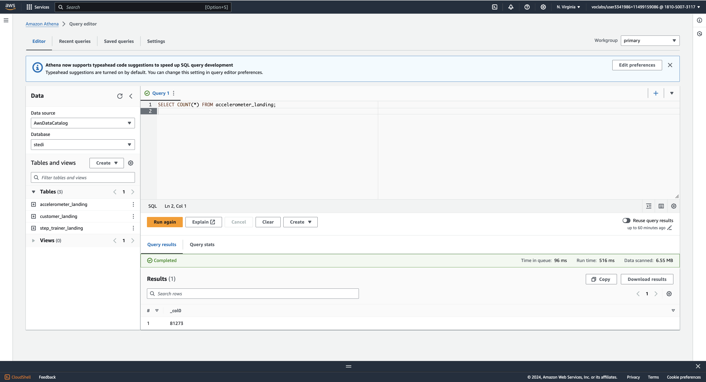
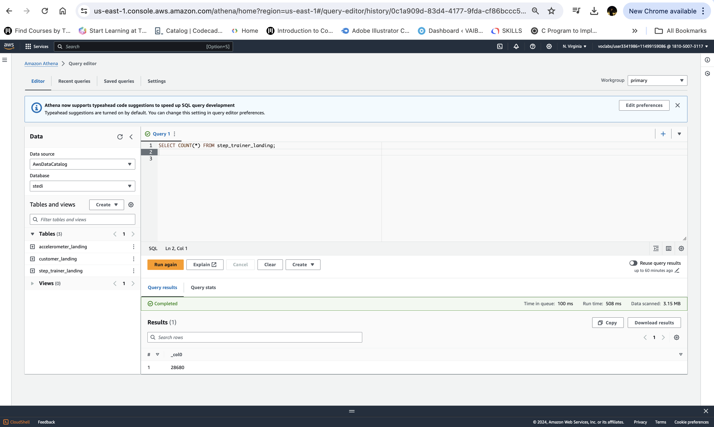
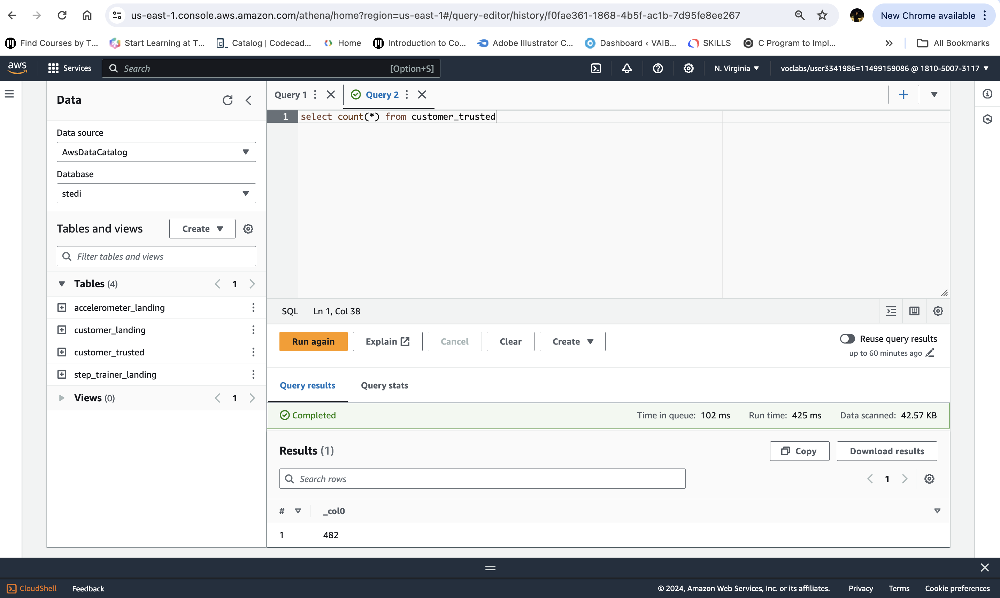
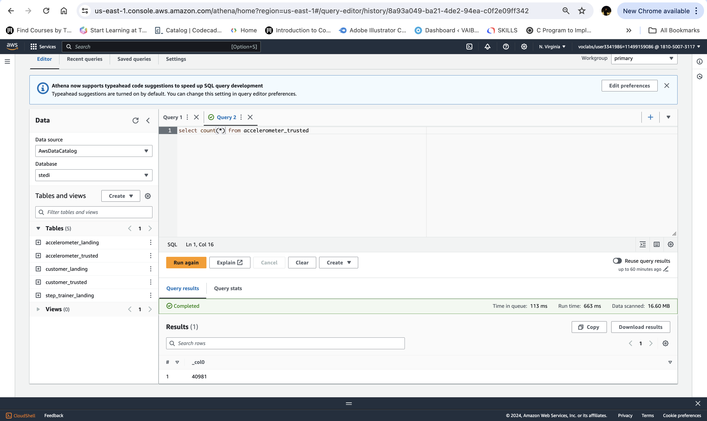

# stedi-human-balance-analytics_spark_datalakes
STEDI Human Balance Analytics (SPARK, DATA LAKES, AWS Glue, AWS Athena, AWS S3)

Using AWS Glue, AWS S3, Python, and Spark, create or generate Python scripts to build a lakehouse solution in AWS

All th python scripts are present in "glueJob_python_scripts" folder

**Landing Zone (Raw Data)**

Customer: 956

Accelerometer: 81273

Step Trainer: 28680

**Trusted Zone (Filtering,PII)**

Customer: 482

Accelerometer: 40981

